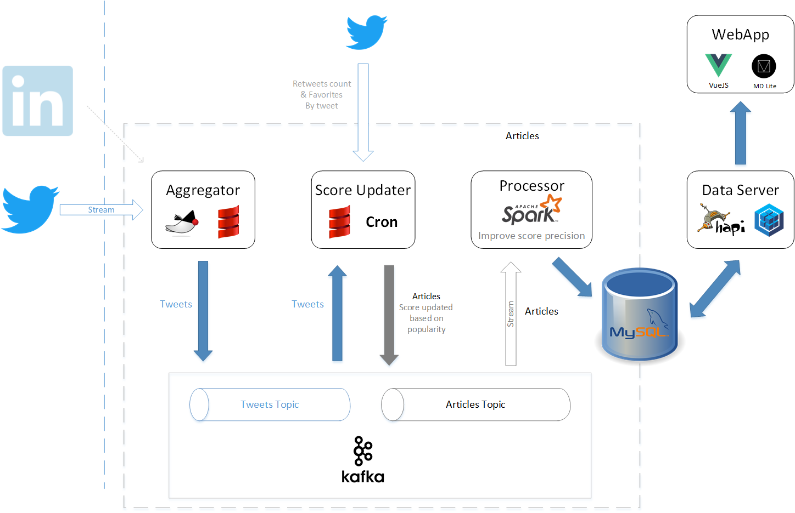

That project is a **Work In Progress**

# Current State

At the moment only Twitter is supported.



# Components

This system is composed of 6 elements

- An **aggregator** : aggregates tweets, posts and all other items streamed from the sources (Twitter, Instagram...). All tweets are put in a pending topic in Kafka for 12h.
- A **score updater** (Twitter specific) : loads periodically (every 12h) all pending tweets and update their Score based on their current popularity, before sending them for analytics and persistence   
- 

# Article Streamer

The idea of this project is to provide a tool that will aggregate articles about one or several provided subjects (Scala, Spark...) 
from various sources (Twitter, Linkedin, Blogs... ). 
For each a score will be calculated. That score will represent the potential interest or value based on their popularity and other factors (to be determined)

## Deploy and run the Aggregator on Heroku

Deploy to heroku

```$ sbt assembly deployHeroku```

Start the Aggregator in a worker

```$ heroku ps:scale worker=1```

Verify if it works

```$ heroku logs```

Stop the Aggregator

```$ heroku ps:scale worker=0``` 

## Docker

One of the options to run this system is Via Docker containers. Here are a couple of directions to help you install it by that mean.

### Docker Compose

The provided _docker-compose.yml_ file will start the aggregator, kafka and zookeeper all at once in separate containers.
```
$ docker-compose up -d
```
To see the logs
```
$ docker-compose logs -f
```
Stop all at once
```
$ docker-compose stop -t 60
```

### Kakfa

This project is design to work with Kafka 10 (v0.10.1.0). 
You can either use your own installation or docker images such as [jplock/zookeeper](https://hub.docker.com/r/jplock/zookeeper/) 
for Zookeeper and [ches/kafka](https://hub.docker.com/r/ches/kafka/)
```
$ docker run -d -p 2181:2181 --name zookeeper jplock/zookeeper:3.4.6
$ docker run -d -p 9092:9092 --name kafka --link zookeeper:zookeeper ches/kafka:0.10.1.0
```

### Aggregator

To build the docker image you first need to fill the environment variable file **docker-env.list**, 
then run the following commands from the root
```
// Build a Fatjar in ./docker
$ sbt "project aggregator" coverageOff assembly
// Build the image
$ docker build -t [dockerhub-username]/[project] ./aggregator/docker/.
```

### Twitter Score Updater

```
// Build a Fatjar in ./docker
$ sbt "project twitterScoreUpdater" coverageOff assembly
// Build the image
$ docker build -t [dockerhub-username]/[project] ./twitter-score-updater/docker/.
```

# Testing

To run the tests and generate the coverage reports (./[PROJECT]/target/scala-2.11/scoverage-report/index.html)


Aggregator
```
$ sbt test-agg
```

Twitter score updater
```
$ sbt test-score
```

Processor
```
$ sbt test-proc
```

Shared entities
```
$ sbt test-shared
```

All at once
```
$ sbt test-all
```

# Viewer 
 
 Allows to visualize the pending/accepted/rejected articles. The app is composed of the modules _data-server_ and _webapp_ .
 
## Data Server
 
 Used as a data server to access the Database in a REST fashion. Uses Hapi and Sequelize
 
### Configuration
 The configuration for the app host/port and database access is in _config/default.json_ , you can override it by adding a _local.json_ in the same directory 
 
### Install and run
 ```
 $ cd data-server
 $ npm install -g nodemon
 $ npm install
 $ npm start
 ```
 
 If all goes well you should see this output, indicating that the server started and Sequelize managed to connect :
 ```
 Executing (default): SELECT 1+1 AS result
 ```
 Every change will hot reload all resources automatically
   
## Web UI
 
 Simple single page app with a server delivering static content. 
 It only contains the UI components, and relies on the Data Server for the content. Based on *Vuejs* and *Webpack*.
  
  ```
  $ cd webapp
  $ npm install
  $ npm run dev
  ```
  You should see an output similar to :
  ```
  Listening at http://localhost:8080
  ```
  Every change will hot reload all resources automatically